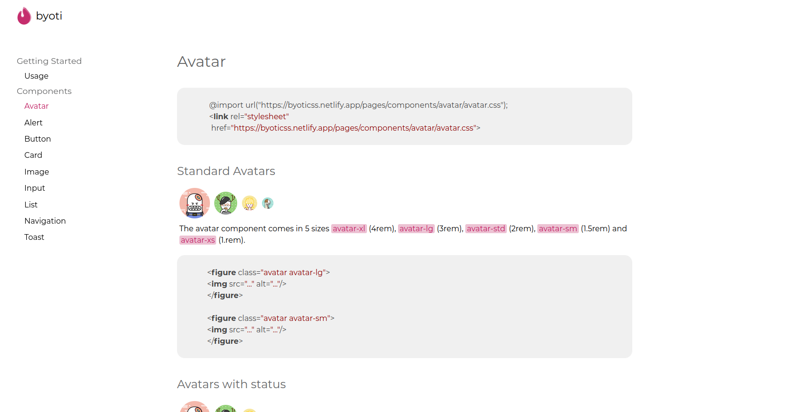
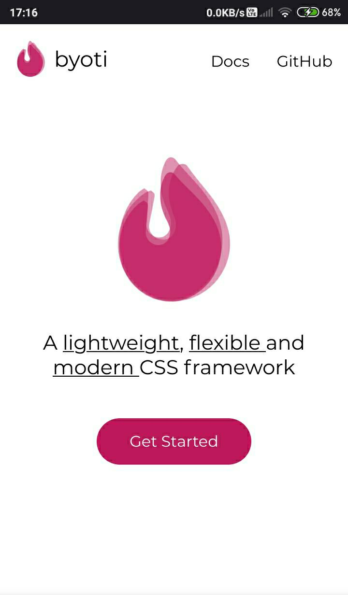
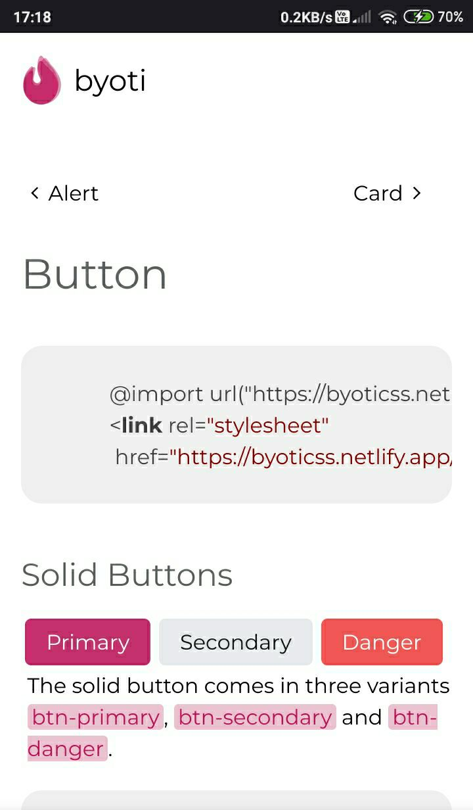

<p align="center">
    
</p>
<h1 align="center">byotiCSS</h1>
<p align="center">
A minimalistic component library to help you speed up web development
</p>
</br>


## Quick start

Start using by just including the below link in your stylesheet.

```css
@import url("https://byoticss.netlify.app/css/component.css");
```

## Documentation

The documentation lives at [byoticss.netflify.app/docs](https://byoticss.netlify.app/pages/docs.html). You'll be able to find detailed documentation on usage and the list of all components. 


## Site views

**On dekstop :**
<p align="center">
    
</p>

**On mobile :**
<p align="center">
    
    
</p>


## Credits

Credit where credit is due, this project wouldn't be able to come out this way without been inspired by [Spectre.css](https://github.com/picturepan2/spectre).


